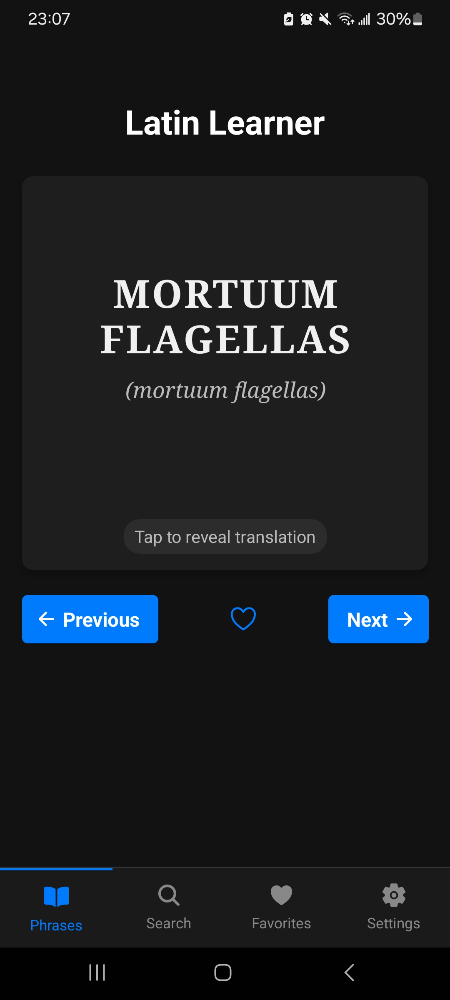
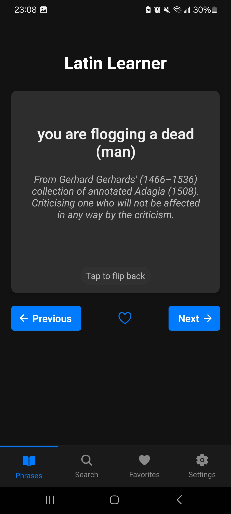
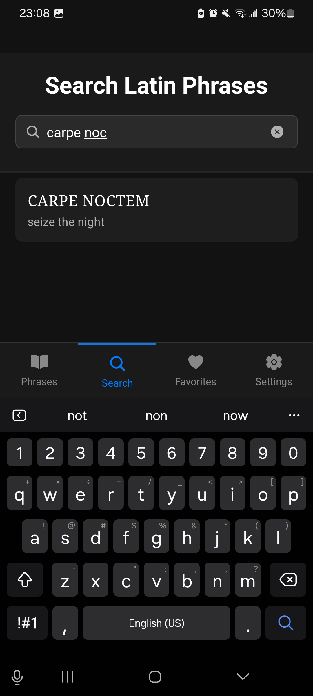
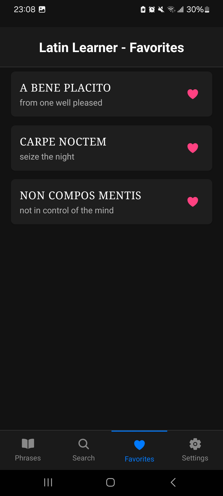
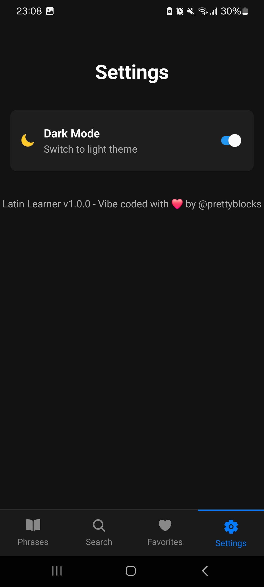

# 🏛️ Latin Learner

<div align="center">
  
  
  
  
  
  
  
  
  <p>A beautiful and intuitive mobile app for learning Latin phrases and their meanings</p>
  
</div>

## ✨ Features

- 📝 **Flashcards**: Learn Latin phrases with interactive flashcards
- 🔄 **Two-sided cards**: Tap to flip between Latin and English translations
- 🔍 **Search**: Find phrases by Latin or English text
- ❤️ **Favorites**: Save your favorite phrases for quick access
- 🌙 **Dark Mode**: Easy on the eyes, day or night
- 📱 **Responsive Design**: Works on both phones and tablets
- 👆 **Easy Navigation**: Intuitive tabbed interface

## 📱 Screenshots

<div align="center">
  <table>
    <tr>
      <td></td>
      <td></td>
      <td></td>
      <td></td>
      <td></td>
    </tr>
  </table>
</div>

## 🛠️ Tech Stack

- [React Native](https://reactnative.dev/) - Mobile framework
- [Expo](https://expo.dev/) - Development platform
- [AsyncStorage](https://react-native-async-storage.github.io/async-storage/) - Local data persistence
- [React Context API](https://reactjs.org/docs/context.html) - State management

## 🤖 Development

This application was entirely "vibe coded" using AI assistance:

- **GitHub Copilot** - Provided code suggestions and implementations throughout development
- **Claude 3.7 Sonnet** - Generated code, solved development challenges, and helped with app architecture

The development process leveraged the power of AI to rapidly prototype, debug, and optimize the application while maintaining high code quality and user experience.

(The AI also wrote this README so take the above with a grain of salt.)

## 📋 Prerequisites

- [Node.js](https://nodejs.org/) (LTS version recommended)
- [npm](https://www.npmjs.com/) or [yarn](https://yarnpkg.com/)
- [Expo CLI](https://docs.expo.dev/workflow/expo-cli/)
- For Android development: Android Studio and Android SDK
- For iOS development: Xcode (Mac only)

## 🚀 Installation

1. Clone the repository:
   ```bash
   git clone https://github.com/eliyastein/latin-learner.git
   cd latin-learner
   ```

2. Install dependencies:
   ```bash
   npm install
   # or with yarn
   yarn
   ```

3. Start the Expo development server:
   ```bash
   npx expo start
   ```

## 📱 Building for Production

### Android APK (for sideloading)

There are several ways to build an APK for sideloading:

#### Option 1: Using EAS Build (Requires Expo account)

1. Install EAS CLI:
   ```bash
   npm install -g eas-cli
   ```

2. Log in to your Expo account:
   ```bash
   eas login
   ```

3. Build the APK:
   ```bash
   eas build --platform android --profile preview
   ```

4. Download the APK from the provided link after build completion

#### Option 2: Local build

1. Run the included build script:
   ```bash
   npm run build:android
   ```
   or
   ```bash
   npm run prebuild:cloud
   ```

2. If you encounter dependency issues, use:
   ```bash
   npm run install:clean
   ```

#### Option 3: Direct Gradle build

1. Generate native projects:
   ```bash
   npx expo prebuild
   ```

2. Navigate to the Android directory:
   ```bash
   cd android
   ```

3. Make gradlew executable (on macOS/Linux):
   ```bash
   chmod +x ./gradlew
   ```

4. Build the APK:
   ```bash
   ./gradlew assembleRelease
   ```

5. Find your APK at:
   ```
   ./app/build/outputs/apk/release/app-release.apk
   ```

### Installing the APK on Android

1. Transfer the APK to your Android device
2. On your device, enable "Install from Unknown Sources" in Settings
3. Open the APK file to install

## 🤝 Contributing

Contributions are welcome! Here's how you can help:

1. Fork the repository
2. Create your feature branch (`git checkout -b feature/amazing-feature`)
3. Commit your changes (`git commit -m 'Add some amazing feature'`)
4. Push to the branch (`git push origin feature/amazing-feature`)
5. Open a Pull Request

## 📄 License

This project includes two separate licenses:

### Application Code

The application code is licensed under the MIT License - see the [LICENSE](LICENSE) file for details.

### Latin Phrases Content

The Latin phrases and translations used in this application are sourced from Wikipedia and are licensed under the [Creative Commons Attribution-ShareAlike 4.0 International License (CC BY-SA 4.0)](https://creativecommons.org/licenses/by-sa/4.0/).

In accordance with Wikipedia's licensing requirements:

- **Attribution**: Content from Wikipedia is attributed to its authors, accessible through Wikipedia's edit history.
- **Share-alike**: If you redistribute or modify the Latin phrase content, you must do so under the same CC BY-SA 4.0 license.

This license applies only to the Latin phrases and translations, not to the application code or user interface.

## 🙏 Acknowledgements

- Latin phrases sourced from Wikipedia under CC BY-SA 4.0 license
- [React Native](https://reactnative.dev/) and [Expo](https://expo.dev/) teams for the amazing tools
- [Ionicons](https://ionicons.com/) for the beautiful icons
- [GitHub Copilot](https://github.com/features/copilot) and [Anthropic's Claude 3.7 Sonnet](https://www.anthropic.com/claude) for AI-powered development assistance

## 📞 Contact

If you have any questions or suggestions, feel free to open an issue.

---

<div align="center">
  Made with ❤️ for Latin enthusiasts everywhere<br/>
  Vibe coded with 🤖 GitHub Copilot and Claude 3.7 Sonnet
</div>
